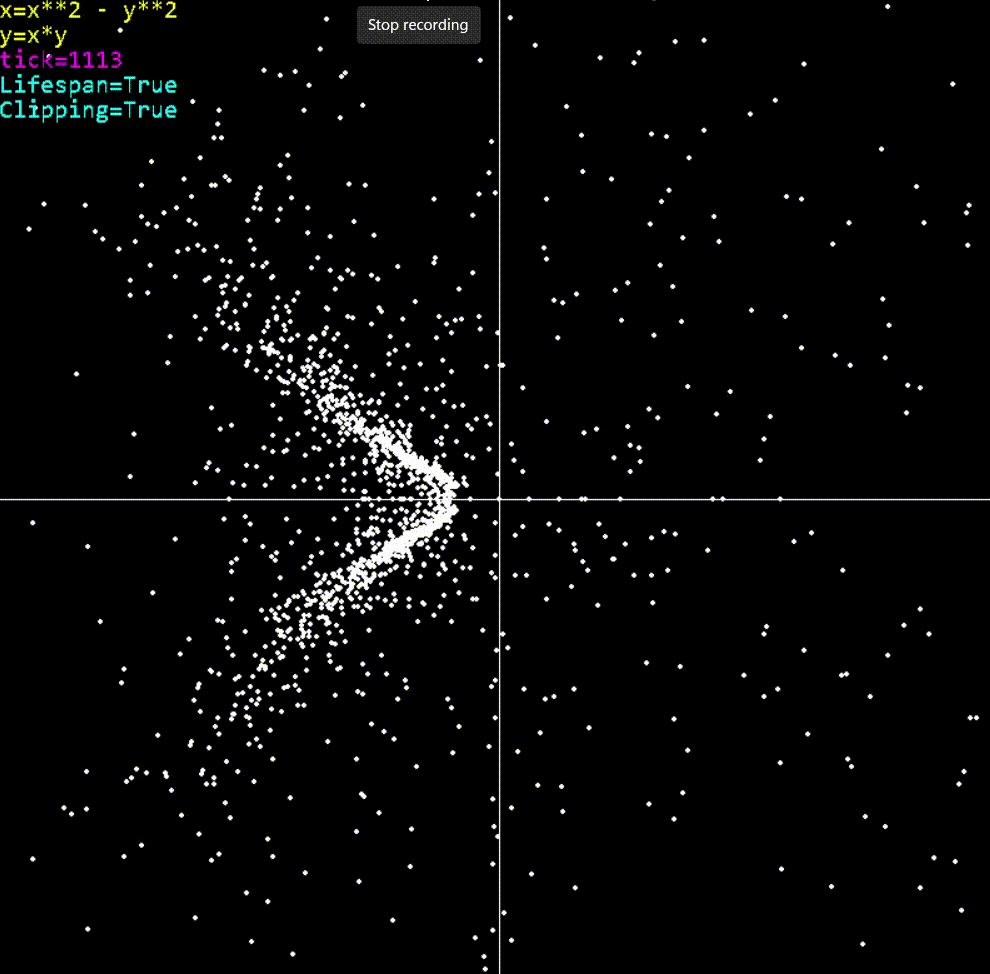

# Vector Field Motion Visualizer#
This is a tool to visualize 2d and 3d vector fields. It shows how particles throughout the coordinate plane are influenced by the push of the field. The 3d version support 2 axes of rotation

(Notice the following examples began recording several seconds into the simulation)

## 2d Examples##

#### Vector field of <sin(y/2), cos(x/2)> ####

#### Vector field of <x^2 - y^2, xy> ####

## 3d Examples##

#### Vector field of <-y, x, 0> ####

#### Vector field of <-y/(x**2 + y**2 + z**2 + 0.01), x/(x**2 + y**2 + z**2 + 0.01), z/(x**2 + y**2 + z**2 + 0.01)> ####

